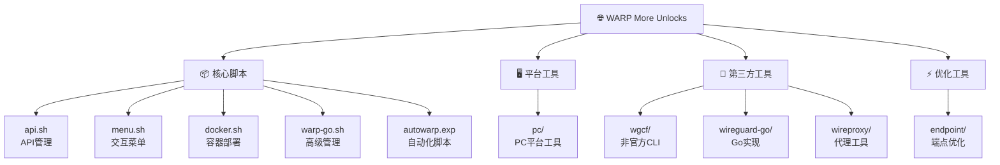

# WARP 网络解锁工具集合

## 变更日志

### 2025-08-22 
- 完成项目AI上下文初始化
- 生成项目架构概览和模块索引
- 创建Mermaid结构图和导航面包屑

## 项目愿景

本项目是一个功能丰富的WARP（Cloudflare VPN）网络解锁工具集合，致力于为用户提供免费、快速、安全的网络连接解决方案。通过集成多种WARP实现方式和代理工具，为不同平台和使用场景提供便捷的一键部署脚本。

## 架构概览

项目采用模块化设计，每个模块专注于特定的功能领域：

- **核心脚本层**：提供主要的WARP安装和管理功能
- **平台支持层**：为不同操作系统和平台提供定制化支持
- **工具集成层**：集成第三方WARP工具和代理实现
- **辅助工具层**：提供端点优化和网络配置等辅助功能

### 技术架构特点

- **跨平台兼容**：支持Linux、macOS、Docker等多种环境
- **多协议支持**：包含WireGuard、SOCKS5、HTTP等多种协议
- **自动化部署**：提供一键安装和配置脚本
- **智能优化**：自动选择最佳MTU和端点配置

## 模块结构图



## 模块索引

| 模块路径 | 模块名称 | 主要功能 | 技术栈 |
|---------|---------|---------|--------|
| `/` | 核心脚本集 | WARP账户管理、一键安装、交互菜单 | Bash, Expect |
| `pc/` | PC平台工具 | macOS一键WARP脚本 | Bash, WireGuard |
| `wgcf/` | 非官方CLI | 跨平台WARP命令行工具 | Go, WireGuard |
| `wireguard-go/` | WireGuard Go实现 | WireGuard用户空间实现 | Go |
| `wireproxy/` | 代理工具 | SOCKS5/HTTP代理服务 | Go, WireGuard |
| `endpoint/` | 端点优化 | 网络端点测试和优化 | 二进制工具 |

## 运行和开发

### 快速开始

```bash
# 交互式菜单（推荐）
bash menu.sh

# 使用warp-go高级功能
bash warp-go.sh

# Docker部署
bash docker.sh

# macOS一键安装
sudo curl -o /usr/local/bin/mac.sh https://raw.githubusercontent.com/fscarmen/warp/main/pc/mac.sh && bash mac.sh c
```

### 主要命令选项

```bash
# 账户管理
bash api.sh                    # API接口管理
bash warp-go.sh a              # 账户升级
bash warp-go.sh i              # 更换Netflix IP

# 网络配置
bash warp-go.sh 4              # IPv4单栈
bash warp-go.sh 6              # IPv6单栈  
bash warp-go.sh d              # 双栈模式
bash warp-go.sh n              # 非全局模式

# 系统管理
bash warp-go.sh u              # 卸载
bash warp-go.sh v              # 版本同步
```

### 依赖要求

- **通用**: curl, wget, grep, bash
- **Linux**: systemctl, ip命令, TUN模块支持
- **macOS**: brew, wireguard-tools
- **Docker**: 支持host网络模式或0.0.0.0监听

## 测试策略

### 自动化测试
- **脚本测试**: 各模块的安装和卸载流程
- **网络测试**: WARP连接性和IP切换功能
- **兼容性测试**: 多系统和多架构支持

### 手动测试清单
- [ ] 各平台一键安装功能
- [ ] 账户注册和升级流程
- [ ] 网络连接和代理功能
- [ ] 配置文件导出功能

## 编码标准

### Shell脚本规范
- 使用`#!/usr/bin/env bash`作为shebang
- 函数名使用小写+下划线命名
- 变量名使用大写字母
- 包含错误处理和日志输出

### 代码结构
- 模块化函数设计
- 统一的语言支持(中/英文)
- 配置参数化
- 详细的注释说明

### 最佳实践
- 参数验证和错误处理
- 支持非交互式运行
- 提供详细的帮助信息
- 兼容多种系统环境

## AI使用指南

### 代码分析
- 理解Shell脚本的系统调用和网络配置
- 分析WireGuard配置和网络路由规则
- 解读API调用和账户管理逻辑

### 问题诊断
- 网络连接问题排查
- 系统兼容性问题分析
- 配置文件错误定位

### 功能扩展
- 新平台支持开发
- 功能模块集成
- 性能优化建议

### 注意事项
- 涉及网络和系统配置的敏感操作
- 需要root权限的系统调用
- 第三方服务依赖和API调用

---

*最后更新: 2025-08-22*